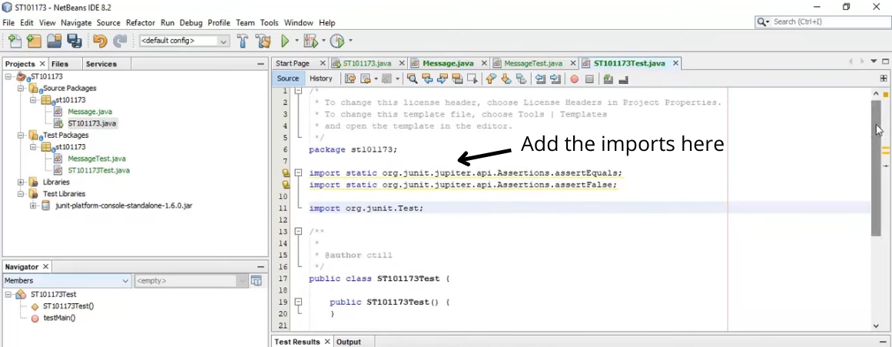
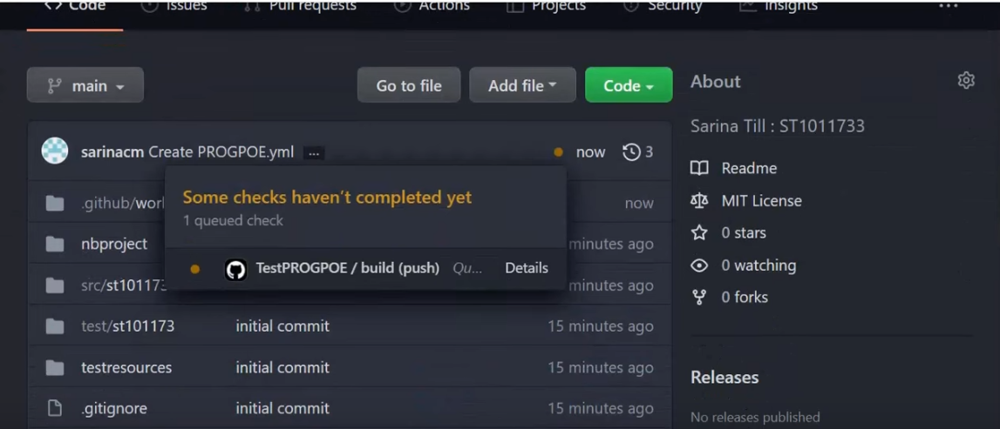

# Unit Testing in Java

>_If you haven't connected your project to GitHub at this point then please ensure that you do so before continuing. For a tutorial on how to do that you can refer to the [YouTube videos](https://youtube.com/playlist?list=PL480DYS-b_kfHSYf2yzLgto_mwDr_U-Q6) made available to you!_

***NOTE: All Videos Linked Here Are Time Stamped To Take You Directly To The Relevant Section of The Video***

# Requirements:
Please ensure that you have downloaded the following files:
* The [.JAR file](https://github.com/r1337x/Unit-Testing-Tutorial/blob/main/junit-platform-console-standalone-1.6.0.jar) - ***Included in this repo***
* The [TestJava.yml file](https://github.com/r1337x/Unit-Testing-Tutorial/blob/main/TestJava.yml) - ***Included in this repo***

**NOTE: Please edit your .gitignore file & remove the .jar file extension from this file. If you do NOT remove this line from the .gitignore file, then the jar file will never be uploaded to GitHub.**

# Adding the .JAR File To Your Project
The first step in order to start unit testing your application is to add the downloaded .jar file to your project. In order to do this, please refer to [THIS VIDEO](https://youtu.be/M9DzeAw3uMY?t=196)

# Start Testing Your Classes
## **Add The Tests**
To test your classes and write unit tests for them, please refer to **[THIS VIDEO](https://youtu.be/fQaUsfEzGdw?t=130)**

## **Add The Imports**
For each test class, you will be needing the following imports:
```java
import static org.junit.jupiter.api.Assertions.assertEquals;  

import static org.junit.jupiter.api.Assertions.assertFalse;

import org.junit.Test;
```



## **Writing The Tests**
The type of test required will be determined by the class you are working on/testing. For a walkthrough on how to write unit tests & the different types of test, please refer to **[THIS VIDEO](https://youtu.be/1Pa15vDWG-8?t=61)** as well as **[THIS VIDEO](https://youtu.be/DmL4gG9vG0A)**

## **JUnit Assert Methods**
Assert is a method useful in determining Pass or Fail status of a test case. There are various types of assertions like Boolean, Null, Identical etc. & the one you need to be using depends on your requirements.

Junit which we are using in our project provides a class named Assert, which provides a bunch of assertion methods useful in writing test cases and to detect test failures.

### **Boolean**
If you want to test the boolean conditions (true or false), you can use following assert methods

```java
assertTrue(condition)
```
```java
assertFalse(condition)
```
Here the condition is a **boolean** value.

### **Assert Equals**
If you want to test **equality of two objects**, you have the following methods:

```java
assertEquals(expected, actual)
```

It will return true if: expected.equals( actual ) returns true (The Expected Value = Actual Value)

### **Identical**
If you want to check whether **the objects are identical** (i.e. **comparing two references** to the **same** java object), or different:

```java
assertSame(expected, actual)
```
The above will return true if expected == actual

```java
assertNotSame(expected, actual)
```

**You can read/look up more Junit Assertion Methods [HERE](https://junit.org/junit4/javadoc/4.8/org/junit/Assert.html)**

# **Run The Tests**
To run the test, simply right click the class & click 'Test File'.

You can view that visually on the video **[HERE](https://youtu.be/1Pa15vDWG-8?t=153)**

> ### _Note: If you get any failures, it's most likely due to your tests not being coded properly OR your class isn't working properly. Troubleshoot and solve the issue by looking at the error messages._

# Push Your Code To GitHub
Please refer to [THIS VIDEO](https://youtu.be/SqHkWHtmMJo?t=11) on how to do this step.

# Create A Folder For Test Resources
Please refer to [THIS VIDEO](https://youtu.be/SqHkWHtmMJo?t=55) on how to do this step.

Once the folder is created, add the Junit .jar file (Included in this repo) to this `testresources` folder. 

Push your code to GitHub again. You can view [THIS VIDEO](https://youtu.be/SqHkWHtmMJo?t=110) on how to do that.

# Automating Your Tests on GitHub
This process may seem a bit complex at first so you might want to watch [THE VIDEO](https://youtu.be/dWbDN7lxWu4) and follow along.

In Short:
* After pushing your code to GitHub, go to your repo and click on `Actions` at the top.
* Scroll down until you reach the `Automation` section.
* Look at the `Manual Workflow` card and click `Configure`.
* On the page that opens, you can specify a name for the file in the top bar. Name the file accordingly. In your case it is probably `PROGPOE.yml`
* Copy the contents of the `TestJava.yml` file included in this repo and paste it into your `PROGPOE.yml` file.
* On `Line 3` Change the `name: TestJava` to `TestPROGPOE`
* Follow the video guide from [HERE](https://youtu.be/dWbDN7lxWu4?t=161) onwards and make the neccessary changes to the `PROGPOE.yml` file in order to make it work with your project. This process mostly involves changing paths and adding your class names to the file.

NOTE: Pay special attention to the following lines in the `PROGPOE.yml` file:
* Line 3 - Specify correct name
* Line 33 - Ensure working directory is set (you might not need to edit this)
* Line 34 - Ensure paths & files are correctly mentioned
* Line 38 - Specify correct directory name
* Line 44 - Specify correct directory name
* Line 45 - Ensure paths & files are correctly mentioned (Note: These are `.class` and **not** `.java`)
* Line 49 - Specify correct directory name
* Line 50 - Ensure paths & files are correctly mentioned (Note: These are `.class` and **not** `.java`)
* Line 54 - Specify correct directory name
* Line 62 -  Specify Class to Test

# Commit Your Edited `PROGPOE.yml` file
Click `Commit New File`.

If you go to your repo you should see the following:


This could take about a minute or so to complete. You can go ahead and click on '`Details`' to view the progress and/or outcome of the test to see if it passed or failed.

# Troubleshooting Common Errors:
In most cases, your build will fail for the following reasons:
* Your /path/to/files/ are incorrect.
* You have misspelt a file/class/folder name.
* You have used incorrect casing (capital letter instead of small letter or vice versa)

***NOTE: If your tests have passed locally on your NetBeans IDE then they should pass on GitHub as well. Likewise, if they're failing locally, they will fail on GitHub as well.***

# Adding More Tests:
To Add more tests to your project, refer to [THIS VIDEO](https://youtu.be/omSrINZdSDU)

**NOTE: Remember to add your new classes to the `PROGPOE.yml` file in order for it to be tested using GitHub Actions**

